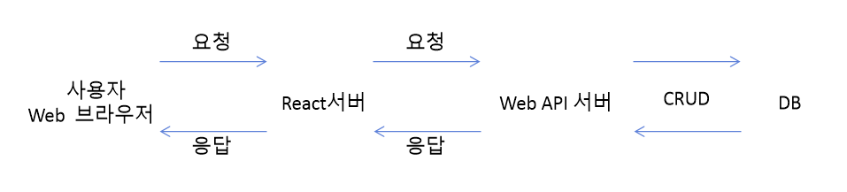

# React 소개

* JS UI Library
    - 오직 View만 관심
    - 추가적인 기능이 필요하면 다른 라이브러리가 요구됨
    - axios, router, redux
* JS 변화: Web UI
    - React: Meta(Facebook)사
    - Vue: google출신 개발자
    - Angular.js: google
    - Svelte
* JS 서버용: Node.js ( +Express )
* JS Desktop용: Electron.js
  - VScode, Atom, Slack
* JS 모바일 앱용
  - Cordova (Phonegap)
  - Ionic
  - Titanium
  - React Native

* UI용 JS에서 사용하는 용어
  - MVC(Model-View-Controller): React
  - MVVM(Model-View-View-Model): View
  - MVW(Model-View-Whatever): Angular
  - Model: 표시할 데이터
    - axios/fetch
  - View: 데이터를 화면에 표현
    - Controller에게서 변경요청이 있으면 화면을 변경(Mutate)
  - Controller: Model에 데이터의 생성, 조회, 수정, 삭제(CRUD)를 요청
    - 요청한 결과를 View에 반영하도록 요청
    - 

* React에서 사용하는 용어
  - Component(컴포넌트): 특정 부분이 어떻게 생길지 정의해 두는 선언체
    - 구성품, 부품: 웹화면을 다루기 쉬운 단위로 나눠서 정의해 두는 객체 또는 함수
  - Template(템플릿): 데이터 셋이 주어지면 HTML태그 형식의 문자열로 변환
  - Rendering(렌더링): 사용자의 화면을 만드는 것
    - 초기렌더링: 제일처음 화면 작성
      - DOM: document.querySelector(), document.getElementById()
    - 리렌더링: 다시 화면 작성
      - React진영: Virtual DOM

# 작업환경 구축
1) node 설치
2) npm, yarn
3) VScode, 확장플러그인 설치
  - ESlint
  - Reactjs Code Snippets
  - Prettier - Code formatter
  - Korean Language Pack for VSCode
4) git 설치
5) create-react-app 패키치로 프로젝트 생성
   - 웹팩(webpack), 바벨(babel), 각종 설정을 한꺼번에 해줌
   - yarn create react-app <프로젝트명>
     - yarn create react-app hello-react
   - cd hello-react
   - yarn start
